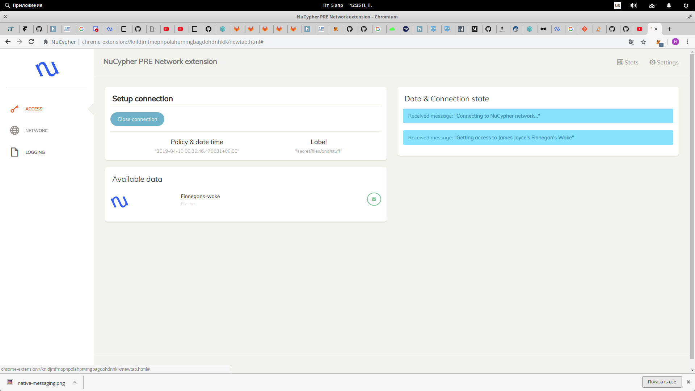
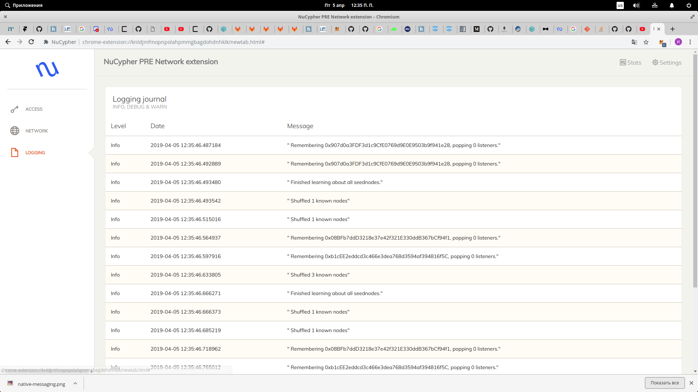
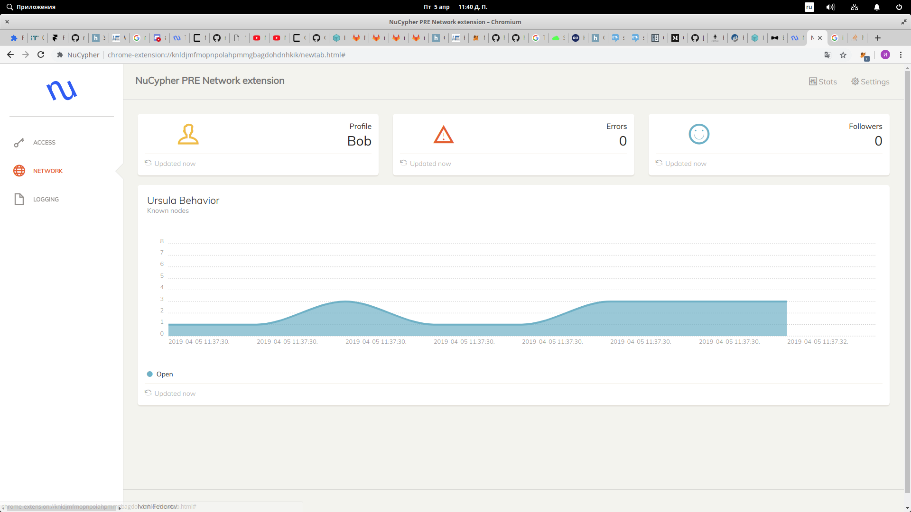

# NuCypherChromeExtensionCoinlistHack

[]

# Structure

<ol type="1" style="font-size: x-large;">
<li> About
<li> Native Messaging protocol
<li> Solution
<ol type="a" style="font-size: large;">
  <li> Connection & share
  <li> Logging
  <li> Dashboard
</ol>
<li> [Installation](#installation)
<li> [Finally](#finally)
<li> [Contacts](#contacts)
</ol>

# About
My name is **Ivan Fedorov** and I introduce the **NuCypher google chrome extension** - which helps sharing your datafiles in a safe way using NuCypher technology.

<a href="">Video-presentation of the ChromeExtension</a>

Opportunities of my project:
- start NuCypher network connection with chrome extension
- requests to Alice
- get Alice's grants for data access
- logging information with native messaging protocol
- simple dashboard which can show information about user and real-time chart with known nodes

# Native Messaging protocol

Native messaging enables an extension to exchange messages with a native application installed on the user's computer. This enables native applications to provide a service to extensions without needing to be reachable over the web. The native application is not installed or managed by the browser: it's installed using the underlying operating system's installation machinery. Along with the native application itself, you'll need to provide a JSON file called the "host manifest" or "app manifest", and install it in a defined location on the user's computer. The app manifest file describes how the browser can connect to the native application.

[]

# Solution

My solution is a product implemented as a google chrome extension, as well as it can be used at chromium browser.

<a href="https://youtu.be/pmoMzzIR458">Video-presentation</a>

The extension is fully functional and you can try it in action after installation.

In my project, I tried to take into account everything for the safe storage of documents and convenient use for file sharing between people. The extension is a complete solution to the problem, plus it is cross-platform because you need only google chrome browser. This extension is fully functional and can be used right now. I believe that this is a great result during the hackathon.

Next, I will consider the main blocks of my solution and their technical implementation.

# Connection & share

Firstly, we need to connect to NuCypher network. In this stage I use local nodes, which I ran on my host before. 

Detailed installation instructions are given in the <a href="#installation">“Installation”</a> section.

Let's take a look at how the extension works:

1. First, we run extension at the browser.
2. We click on a "connect" button and see all the documents available to us and get messages from the host with first sharing document. 
3. We can close connection and stop sharing files. 

In this case NuCypher connection starts with our extension together.  

You can watch a video demonstration of the product: 

https://youtu.be/pmoMzzIR458

# Logging

NuCypher leverages the power of proxy re-encryption to bring private data to public blockchains. How does it work? We can easy watch log information in our chrome extension!

# Dashboard

A simply dashboard was implemented to watch states of nodes and number of warnings and errors. It is very convenient method for tracking NuCypher network. 

# Installation
Requirements:
1. Python >=3.6
2. Google chrome/chromium

How to run extension (tested on Linux Ubuntu/Elementary):
After git clone:

- cd NuCypherBack/nucypher
- pipenv install --dev --three --skip-lock --pre
- pipenv shell 
- sh scripts/local_fleet/run_local_fleet.sh

If all success, you will see: 
Starting Local Development Fleet... 
Starting Lonely Ursula... 
Starting Ursula #2... 
Starting Ursula #3... 

After that:
- sudo Extesion/install_host.sh
Next:
- at google chrome: in developer mode load unpacking extension from dir with manifest.json (Extesion)
- run extension from google-chrome apps

***!!! in file com.google.chrome.example.echo.json you need edit run.sh script's path on your custom
"path": "$YOUR_LOCATION/n2/nucypher/run.sh" !!!***

# Finally

**NuCypher chrome extension** is a complete product for safe storage and share of your documents in one place and convenient use.

<a href="https://youtu.be/pmoMzzIR458">Video-presentation</a>

During this hackathon:

- I have created a fully working chwome extension for the safe storage and sharing of documents.
- Thanks to native messaging protocol project has the opportunity tracking log information about NuCypher network processes.
- In order to track states of nodes and number of errors/warning  I implemented a simple dashboard.

# Contacts

- telegram @vanesfedorov
- email: if1242@yandex.ru
